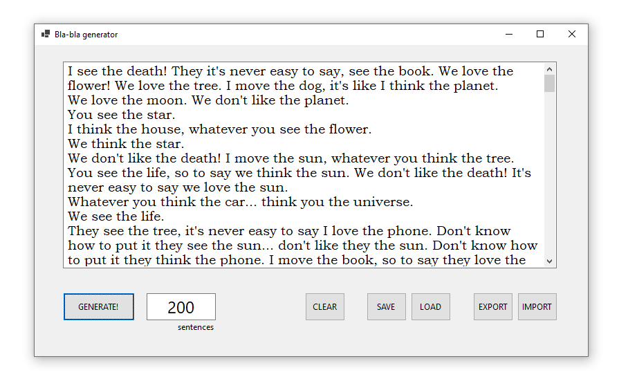

# This is the Bla-bla generator.

The app will generate a nonsense bla-bla text for you, which you can save for later and load back the next time you need it.

User interface:

The window consists of four elements:
* Main editable text window - a generated text appears here. The text can be copied to the clipboard for further use;
* "Generate" button - automatically clears the text window and generates new text. 
* "Clear" button - removes all text from the text window;
* "Save" button - saves the text from the text windows to the local database;
* Load" button - loads text from the local database into the text window.